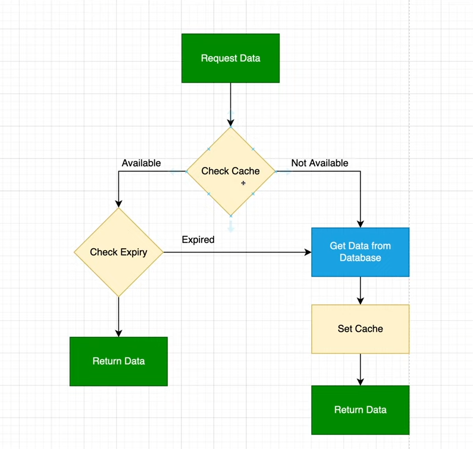

# .NET 6 Web API with Redis as a Cache and PostgreSQL

This project is a .NET 6 Web API application that uses Redis for caching and PostgreSQL as the relational database.

## Prerequisites

Ensure you have Docker and .NET 6 SDK installed on your machine.

## Setup Instructions

### 1. Set Up Redis

To start a Redis container, run the following Docker command:

```bash
docker run --name my-redis -p 6379:6379 -d redis
```

- **Redis**: An in-memory data structure store used as a database, cache, and message broker. This command sets up Redis in a Docker container and exposes it on port 6379.

### 2. Set Up PostgreSQL

To start a PostgreSQL container, run the following Docker command:

```bash
docker run --name my-postgres -e POSTGRES_PASSWORD=mysecretpassword -p 5432:5432 -d postgres
```

- **PostgreSQL**: A powerful, open-source relational database system. This command sets up PostgreSQL in a Docker container with a specified password for the default user and exposes it on port 5432. The `POSTGRES_PASSWORD` environment variable sets the password for the default `postgres` user.

## Project Dependencies

### 3. Add Entity Framework Core

Entity Framework Core (EF Core) is an object-database mapper (ORM) that simplifies data access by allowing you to interact with your database using .NET objects, eliminating the need for most of the data-access code that developers usually need to write.

Add EF Core package:

```bash
dotnet add package Microsoft.EntityFrameworkCore
```

### 4. Add PostgreSQL Provider for EF Core

To enable EF Core to work with PostgreSQL, add the following package:

```bash
dotnet add package Npgsql.EntityFrameworkCore.PostgreSQL
```
This package provides PostgreSQL database provider support for Entity Framework Core. It allows your .NET application to interact with a PostgreSQL database using Entity Framework Core.

### 5. Add EF Core Design Tools

To use design-time features like migrations, add:

```bash
dotnet add package Microsoft.EntityFrameworkCore.Design
```

This package provides design-time tools for Entity Framework Core, such as the `dotnet ef` command-line tool. It is used for tasks like creating and applying migrations, and scaffolding a DbContext and entity types from an existing database schema.

### 6. Add EF Core Tools

For additional management tools and commands, add:

```bash
dotnet add package Microsoft.EntityFrameworkCore.Tools
```

This package provides additional tools for Entity Framework Core, including the `dotnet ef` command-line tool. It is used for managing migrations, updating the database schema, and generating code for the DbContext and entity classes.

### 7. Add Redis Client

To interact with Redis, add the Redis client package:

```bash
dotnet add package StackExchange.Redis
```

This package provides a high-performance Redis client for .NET. It is used to interact with Redis from your .NET application, enabling operations such as caching, data storage, and message brokering.

### 8. Add Redis Caching Support

To enable distributed caching using Redis in your .NET application, add:

```bash
dotnet add package Microsoft.Extensions.Caching.StackExchangeRedis
```

This package provides distributed caching support using Redis for .NET applications. It integrates with the ASP.NET Core caching infrastructure, allowing you to use Redis as a distributed cache to improve the performance and scalability of your application.

## Entity Framework Core Commands

### 9. Install EF Core Tools Globally

Install the EF Core command-line tools to manage migrations and update the database schema:

```bash
dotnet tool install --global dotnet-ef
```

### 10. Add Initial Migration

Create an initial migration to set up your database schema:

```bash
dotnet ef migrations add "initial_migration"
```

Migrations are used to keep the database schema in sync with the application's data model. This initial migration will create the necessary tables and schema based on your current data model.

### 11. Apply Migrations to the Database

Update the database schema to reflect the current data model:

```bash
dotnet ef database update
```

This command applies the pending migrations to the database. It updates the database schema to match the current data model defined in your application.

## Summary

This setup will help you create a .NET 6 Web API application with PostgreSQL as the database and Redis for caching. Follow the instructions to set up the necessary containers, add the required packages, and manage your database schema using EF Core.

For any questions or issues, refer to the official documentation of Docker, .NET, Entity Framework Core, Redis, and PostgreSQL.

