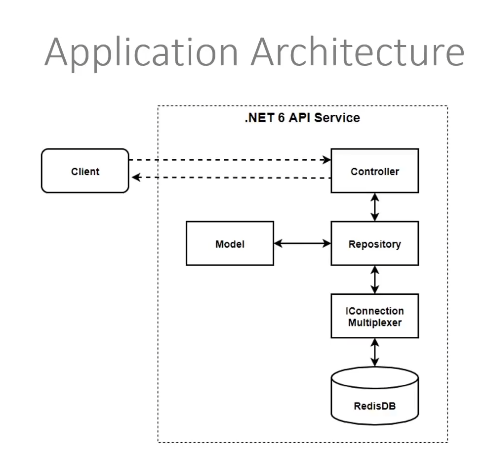
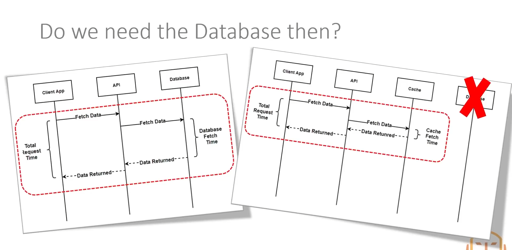
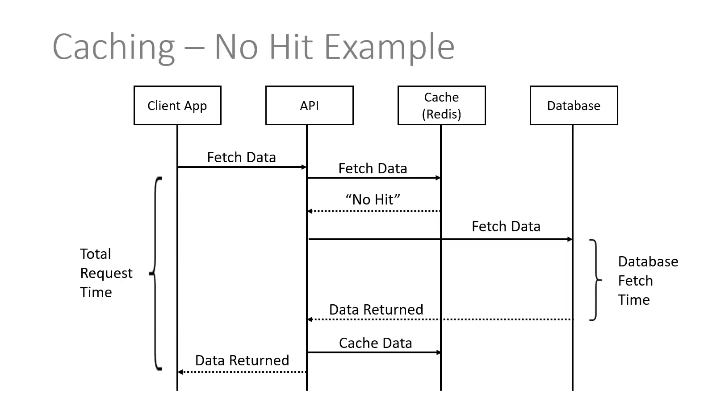
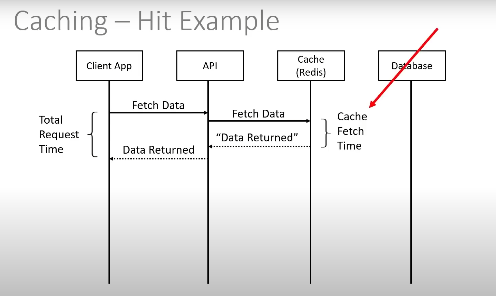

# Redis as a Primary DB using a .NET 6 API

To run the Redis container, use the following command:

```sh
docker compose up -d
```

To access the Redis container and use the Redis CLI, use the following commands:

```sh
docker exec -it redis_api /bin/bash
redis-cli
```

## Which Package?

- **Microsoft.Extensions.Caching.Redis** (essentially deprecated)
- **Microsoft.Extensions.Caching.StackExchangeRedis**
- **StackExchange.Redis**

### Boils down to whether you want to use:
- **IDistributedCache** (restricted datatypes)
- **IConnectionMultiplexer** (all datatypes available)

### Package Details:
- **Microsoft.Extensions.Caching.Redis**: This package is essentially deprecated and not recommended for new projects.
- **Microsoft.Extensions.Caching.StackExchangeRedis**: This package integrates `StackExchange.Redis` with the `IDistributedCache` interface, which is useful for caching scenarios where you need to store and retrieve data in a distributed cache. It supports a limited set of data types.
- **StackExchange.Redis**: This package provides a low-level API for interacting with Redis. It uses the `IConnectionMultiplexer` interface, which allows you to work with all Redis data types and provides more control over Redis operations.

### Usage in This Project:
In this project, we are using the `Microsoft.Extensions.Caching.StackExchangeRedis` package. This allows us to leverage the `IDistributedCache` interface for caching, which is useful for scenarios where a simple, distributed caching mechanism with limited data types is sufficient.

### Data Types Used in Redis

#### Strings

Strings are the most basic type of value you can store in Redis. They are binary safe and can contain any kind of data.

**Redis CLI:**

```sh
SET key value
GET key
```

**.NET Syntax:**

```cs
await _cache.SetStringAsync("key", "value");
var value = await _cache.GetStringAsync("key");
```

#### Diagram

```plaintext
        Key
         |
       Value
```

#### Hashes

Hashes are maps between string fields and string values, making them perfect for representing objects. They are suitable for storing structured objects.

**Redis CLI:**

Set using HMSET:

```sh
HMSET <id> <field1> <value1>
```

Get all items using HGETALL:

```sh
HGETALL <id>
```

Get individual items using HGET:

```sh
HGET <id> <field1>
```

Example:

```sh
HMSET user:1 name "John Doe" age "30"
HGETALL user:1
HGET user:1 name
```

**.NET Syntax:**

```cs
var hashEntries = new HashEntry[]
{
    new HashEntry("name", "John Doe"),
    new HashEntry("age", "30")
};
await _database.HashSetAsync("user:1", hashEntries);

var user = await _database.HashGetAllAsync("user:1");
var name = await _database.HashGetAsync("user:1", "name");
```

#### Diagram

```plaintext
      Key 1
        |
  +-------------+
  |             |
Field 1       Field 2
 Value 1       Value 2


      Platforms
        |
  +-------------+
  |             |
987666       685575
[platform]   [platform]

```

#### Sets

Sets are collections of unique, unordered strings. They are useful for 1-to-many mappings between keys and values.

**Redis CLI:**

Set using SADD:
```sh
SADD myset "value1" "value2"
```

Returned using SMEMBERS:
```sh
SMEMBERS myset
```

Check if a value is present in the set using SISMEMBER:

```sh
SISMEMBER myset "value1"
```

**.NET Syntax:**
```cs
await _database.SetAddAsync("myset", new RedisValue[] { "value1", "value2" });

var members = await _database.SetMembersAsync("myset");
```

#### Diagram

```plaintext
             Key
              |
   +---------------------+
   |          |          |
Value 2    Value 1    Value 3
```

---






